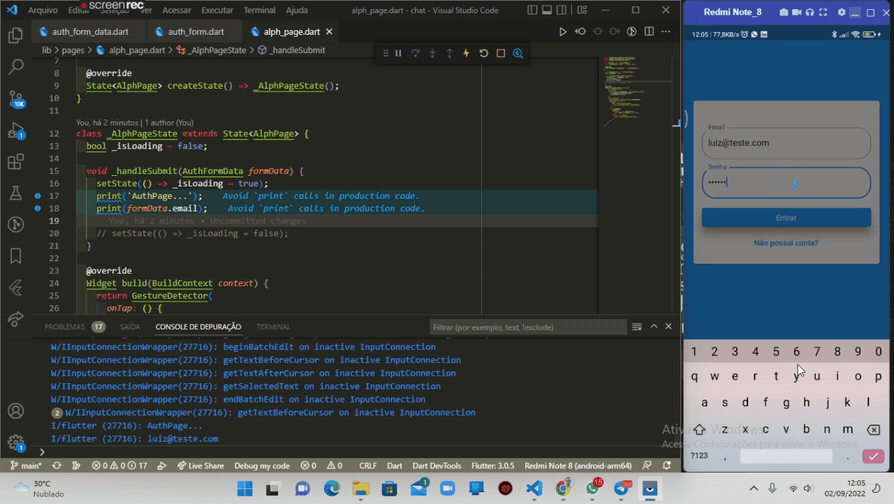

<h1 align="center">CHAT</h1>

### » O QUE SERÁ CONSTRUÍDO:
---

> LEGENDA: ✅ Implementado ⚪ Ainda não implementado
___

✅ Página de Registro e login -> Validação de campos, confirmar Logar e cadastrar em um mesmo botão, ocultar campos.

✅ Screen de Loadin

 ⚪ Utilizando o imagePicker para pegar a imagem da galeria e da câmera;

⚪ Aplicando Entendendo Stream;

⚪ Registrando Imagem;

⚪ Criando a página do chat;

⚪ Chat Message Model;

⚪ Criando Componente Message;

⚪ Implementando Notification Service;

⚪ Icone de notificação;

⚪ Noficando a página;

⚪ Instanciando Firebase APP;

⚪ Habilitando Autenticação no Firebase;

⚪ Firebase Storage;

⚪ Salvando Mensagens do Firestore;

⚪ Obtendo Mensagens do Firestore;

⚪ Push Notification;

⚪ Configurando Push Notification no iOS.

### Autor

